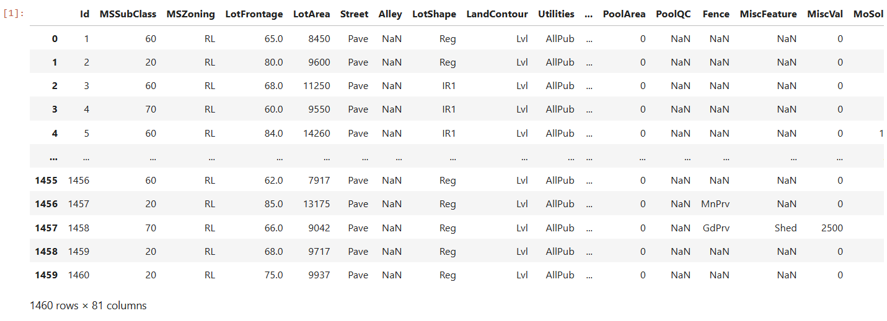
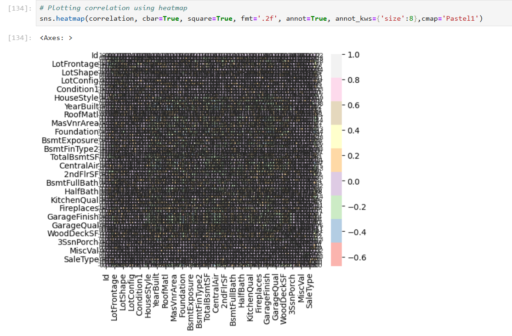

# House Price Prediction

## Objective
The House Price Prediction project aimed to analyze and model real-world housing data to accurately predict property prices based on multiple influencing factors. The objective was to perform end-to-end data analysis, including exploratory data analysis (EDA), data preprocessing, feature selection, and model training using a Random Forest algorithm. This project provided hands-on experience in building, evaluating, and optimizing a machine learning regression model while reinforcing the importance of data-driven decision-making in predictive analytics.

### Skills Learned

- Performed exploratory data analysis (EDA) to understand data patterns, trends, and correlations.
- Applied data preprocessing techniques including handling missing values, encoding categorical features, and feature scaling.
- Built and trained a Random Forest regression model for house price prediction.
- Evaluated model performance using metrics such as MAE, MSE, RMSE, and R² score.
- Gained hands-on experience in end-to-end machine learning workflow, from data ingestion to prediction and evaluation.

### Tools and Packages Used

- **Python** for data analysis, modeling, and implementation.
- **NumPy** for numerical computations and array operations.
- **Pandas** for data manipulation, cleaning, and preprocessing.
- **Matplotlib** for data visualization and plotting.
- **Seaborn** for statistical data visualization during EDA.
- **Scikit-learn** for model building, training, prediction, and evaluation.
- **Jupyter Notebook** for development and experimentation.

## Steps

### 1. 1. Data Collection and Loading
The housing dataset was loaded using Pandas for analysis and modeling. Initial inspection was performed to understand the structure, size, and attributes of the data.

*Ref 1: Dataset Preview*

This step involved checking the first few rows, data types, and basic statistics to gain an overview of the dataset.

2. Exploratory Data Analysis (EDA)

EDA was conducted to identify patterns, trends, correlations, and outliers within the dataset using visualizations and statistical summaries.

*Ref 2: EDA Visualizations*

Plots such as heatmaps, histograms, and scatter plots were used to analyze feature relationships and their impact on house prices.

3. Data Preprocessing

The dataset was cleaned and prepared for modeling by handling missing values, encoding categorical variables, and selecting relevant features This step ensured the data was structured and suitable for machine learning algorithms.

4. Train-Test Split

The processed dataset was split into training and testing sets to evaluate model performance on unseen data. The split helped prevent overfitting and ensured reliable model evaluation.

5. Model Training

A Random Forest Regressor was trained on the training dataset to learn patterns and relationships between features and house prices. The ensemble approach of Random Forest helped improve prediction accuracy and robustness.

6. Prediction and Evaluation

The trained model was used to predict house prices on the test dataset, and performance was evaluated using metrics such as MAE, MSE, RMSE, and R² score.
These metrics provided insight into the accuracy and reliability of the prediction model.

*Ref 2: Prediction Result*

